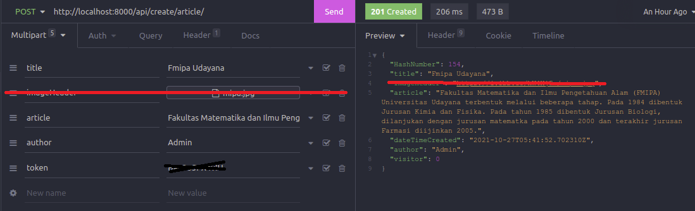

# Application Program Website Blog Unud
<p align="center"></p>
Kumpulan artikel seputar Universitas Udayana.


## Installation

Use the package manager [pip](https://pip.pypa.io/en/stable/) to install all requirements.

```bash
pip install -r requirements.txt
```

## Start Server

```bash
python manage.py runserver
```

## API Reference
<h3 align="center">1. Get All Article</h3>
#### 

```http
   [GET] /api/blog-post/
```


| Parameter | Type     | Description                |Default Value|
| :-------- | :------- | :------------------------- |:------|
| `token` | `string` | **Required**. |None|
| `format`| `string` | **Optional**.  |api|

#### Json Response

```javascript
[
  {
    "HashNumber": 57,
    "title": "Universitas Udayana",
    "imageHeader": "https://i.ibb.co/2yCNvNX/Kampus-Unud.jpg",
    "article": "Sejarah - Cikal bakal Universitas Udayana adalah Fakultas Sastra cabang Universitas Airlangga yang diresmikan oleh P. J. M. Presiden Republik Indonesia Ir. Soekarno, dibuka oleh J. M. Menteri P.P dan K. Prof. DR. Priyono pada tanggal 29 September 1958 sebagaimana tertulis pada Prasasti di Fakultas Sastra, Jalan Nias, Denpasar. Universitas Udayana secara sah berdiri pada tanggal 17 Agustus 1962 dan merupakan perguruan tinggi negeri tertua di daerah Provinsi Bali. Sebelumnya, sejak tanggal 29 September 1958 di Bali sudah berdiri sebuah fakultas yang bernama fakultas Sastra Udayana sebagai cabang dari Universitas Airlangga.\r\n\r\nFakultas Sastra Udayana inilah yang merupakan embrio daripada berdirinya Universitas Udayana. Berdasarkan Surat Keputusan Menteri PTIP No.104/1962, tanggal 9 Agustus 1962, Universitas Udayana secara sah berdiri sejak tanggal 17 Agustus 1962. Akan tetapi, karena hari lahir Universitas Udayana jatuh bersamaan dengan hari Proklamasi Kemerdekaan Republik Indonesia, maka perayaan hari ulang tahun Universitas Udayana dialihkan menjadi tanggal 29 September dengan mengambil tanggal peresmian fakultas sastra yang telah berdiri sejak tahun 1958.[8]",
    "dateTimeCreated": "2021-10-27T02:37:55.134191Z",
    "author": "Admin",
    "visitor": 0
  },
  {
    "HashNumber": 154,
    "title": "Fmipa Udayana",
    "imageHeader": "https://i.ibb.co/hW4XjGx/mipa.jpg",
    "article": "Fakultas Matematika dan Ilmu Pengetahuan Alam (FMIPA) Universitas Udayana terbentuk melalui beberapa tahap. Pada 1984 dibentuk Jurusan Kimia dan Fisika. Pada tahun 1985 dibentuk Jurusan Biologi, dilanjukan dengan jurusan matematka pada tahun 2000 dan terakhir jurusan Farmasi diijinkan 2005.",
    "dateTimeCreated": "2021-10-27T05:41:52.702310Z",
    "author": "Admin",
    "visitor": 0
  }
]
```

#### 
<h3 align="center">2. Get One Article</h3>

```http
  [GET] /api/blog-post/one-item/
```

| Parameter | Type     | Description                       |
| :-------- | :------- | :-------------------------------- |
| `token`      | `string` | **Required** |
| `HashNumber`      | `integer` | **Required** |

#### Example http

```http
  [GET] /api/blog-post/one-item/?token=***?HashNumber=57
```
#### Json Response
```javascript
[
  {
    "HashNumber": 57,
    "title": "Universitas Udayana",
    "imageHeader": "https://i.ibb.co/2yCNvNX/Kampus-Unud.jpg",
    "article": "Sejarah - Cikal bakal Universitas Udayana adalah Fakultas Sastra cabang Universitas Airlangga yang diresmikan oleh P. J. M. Presiden Republik Indonesia Ir. Soekarno, dibuka oleh J. M. Menteri P.P dan K. Prof. DR. Priyono pada tanggal 29 September 1958 sebagaimana tertulis pada Prasasti di Fakultas Sastra, Jalan Nias, Denpasar. Universitas Udayana secara sah berdiri pada tanggal 17 Agustus 1962 dan merupakan perguruan tinggi negeri tertua di daerah Provinsi Bali. Sebelumnya, sejak tanggal 29 September 1958 di Bali sudah berdiri sebuah fakultas yang bernama fakultas Sastra Udayana sebagai cabang dari Universitas Airlangga.\r\n\r\nFakultas Sastra Udayana inilah yang merupakan embrio daripada berdirinya Universitas Udayana. Berdasarkan Surat Keputusan Menteri PTIP No.104/1962, tanggal 9 Agustus 1962, Universitas Udayana secara sah berdiri sejak tanggal 17 Agustus 1962. Akan tetapi, karena hari lahir Universitas Udayana jatuh bersamaan dengan hari Proklamasi Kemerdekaan Republik Indonesia, maka perayaan hari ulang tahun Universitas Udayana dialihkan menjadi tanggal 29 September dengan mengambil tanggal peresmian fakultas sastra yang telah berdiri sejak tahun 1958.[8]",
    "dateTimeCreated": "2021-10-27T02:37:55.134191Z",
    "author": "Admin",
    "visitor": 0
  }
]
```

#### 
<h3 align="center">3. Search Article</h3>

```http
  [POST] /api/search/
```

| Multipart | Type     | Description                       |
| :-------- | :------- | :-------------------------------- |
| `token`      | `string` | **Required** |
| `keyword`      | `string` | **Required** |

#### Json Response
```javascript
    NOT IMPLEMENTED, ON PROGRESS
```

#### 
<h3 align="center">4. Create New Article</h3>

```http
  [POST] /api/create/article/
```

| Multipart | Type     | Description                       |
| :-------- | :------- | :-------------------------------- |
| `token`      | `string` | **Required** - Kode Akses |
| `title`      | `string` | **Required** - Judul Artikel|
| `imageHeader`| `img file` | **Required** - Gambar Header Artikel|
| `article`    | `string` | **Required** - Isi Artikel |
| `author`      | `string` | **Required** - Penulis Artikel|

#### Example


#### 
<h3 align="center">5. Admin Validator</h3>

```http
  [GET/POST] /api/search/
```

| Multipart | Type     | Description                       |
| :-------- | :------- | :-------------------------------- |
| `token`      | `string` | **Required** |
| `...`      | `...` | **...** |

#### Json Response
```javascript
    NOT IMPLEMENTED, ON PROGRESS
```
  