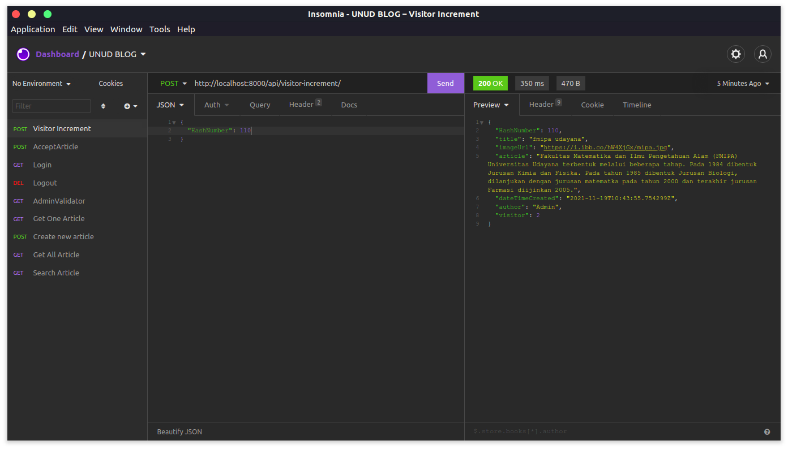
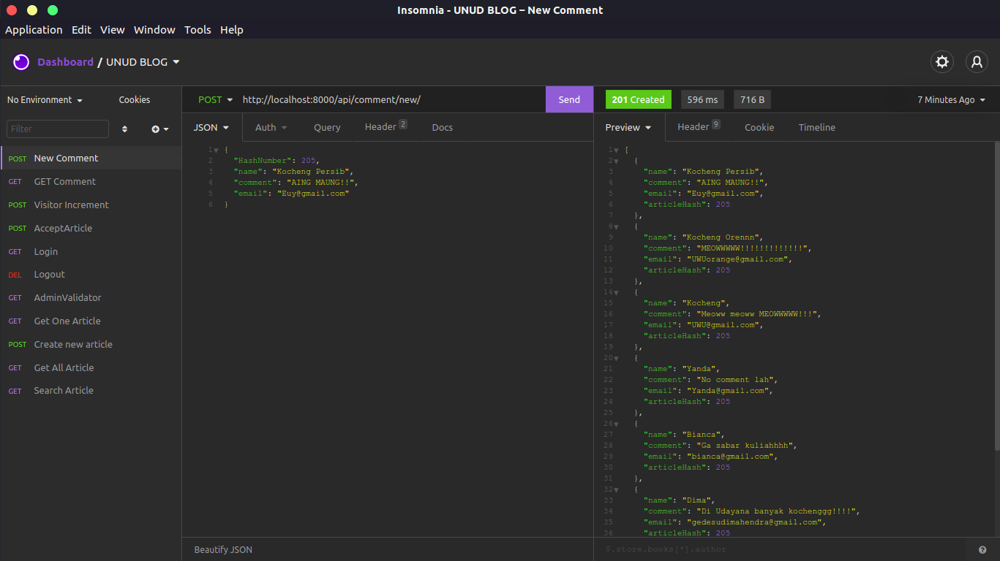

<h1 align="center">Stories Blog Udayana</h1>
<p align="center"></p>
Kumpulan artikel seputar Universitas Udayana.


## Installation

Use the package manager [pip](https://pip.pypa.io/en/stable/) to install all requirements.

```bash
pip install -r requirements.txt
```

## Start Server

```bash
python manage.py runserver
```

## API Reference
<h3 align="center">1. Get All Article [GUEST]</h3>
<h4 align="center">URL : https://stories-from-unud.herokuapp.com/api/blog-post/?sorting=yes </h4>
#### 

```http
   [GET] /api/blog-post/
```
#### Requirements
| Header | Type     | Description                       |
| :-------- | :------- | :-------------------------------- |
| `token`      | `string` | **Required** |

| GET       | Type     | value | Description  |
|:----------| :------- |:------|:-------------|
| `sorting` | `string` | yes   | **Optional** |

#### Response Example


###
<h3 align="center">1.1 Get All Article with pagination [GUEST]</h3>
<h4 align="center">URL : https://stories-from-unud.herokuapp.com/api/blog-post/list?page=1 </h4>
#### 

```http
   [GET] /api/blog-post/list?page=1
```
#### Requirements
| Header | Type     | Description                       |
| :-------- | :------- | :-------------------------------- |
| `token`      | `string` | **Required** |
#### Example Response 3 content page size
```json
{
  "count": 5,
  "next": "https://stories-from-unud.herokuapp.com/api/blog-post/list?page=2",
  "previous": null,
  "results": [
    {
      "HashNumber": 59,
      "title": "teknik udayana",
      "imageUrl": "https://i.ibb.co/mznjmND/20171230-090152.jpg",
      "article": "Fakultas Teknik Universitas Udayana secara resmi berdiri pada tanggal 1 Oktober 1965 dengan Surat Keputusan Menteri PTIP No. 248/Sek/P.U/1965, tanggal 20 Oktober 1965, yang terdiri dari dua jurusan yaitu Jurusan Arsitektur dan Jurusan Seni Rupa. Sebagai latar belakang pendirian Fakultas Teknik Universitas Udayana, adalah dalam rangka pelestarian, pengembangan kebudayaan Daerah Bali pada khususnya dan kebudayaan nasional pada umumnya, terutama di dalam menghadapi pembangunan dan perkembangan kepariwisataan.",
      "dateTimeCreated": "2021-11-19T10:40:40.842714Z",
      "author": "Jeremi",
      "visitor": 3
    },
    {
      "HashNumber": 205,
      "title": "universitas udayana",
      "imageUrl": "https://i.ibb.co/2yCNvNX/Kampus-Unud.jpg",
      "article": "Sejarah - Cikal bakal Universitas Udayana adalah Fakultas Sastra cabang Universitas Airlangga yang diresmikan oleh P. J. M. Presiden Republik Indonesia Ir. Soekarno, dibuka oleh J. M. Menteri P.P dan K. Prof. DR. Priyono pada tanggal 29 September 1958 sebagaimana tertulis pada Prasasti di Fakultas Sastra, Jalan Nias, Denpasar. Universitas Udayana secara sah berdiri pada tanggal 17 Agustus 1962 dan merupakan perguruan tinggi negeri tertua di daerah Provinsi Bali. Sebelumnya, sejak tanggal 29 September 1958 di Bali sudah berdiri sebuah fakultas yang bernama fakultas Sastra Udayana sebagai cabang dari Universitas Airlangga.\\r\\n\\r\\nFakultas Sastra Udayana inilah yang merupakan embrio daripada berdirinya Universitas Udayana. Berdasarkan Surat Keputusan Menteri PTIP No.104/1962, tanggal 9 Agustus 1962, Universitas Udayana secara sah berdiri sejak tanggal 17 Agustus 1962. Akan tetapi, karena hari lahir Universitas Udayana jatuh bersamaan dengan hari Proklamasi Kemerdekaan Republik Indonesia, maka perayaan hari ulang tahun Universitas Udayana dialihkan menjadi tanggal 29 September dengan mengambil tanggal peresmian fakultas sastra yang telah berdiri sejak tahun 1958.[8].",
      "dateTimeCreated": "2021-11-19T10:43:27.123226Z",
      "author": "Admin",
      "visitor": 6
    },
    {
      "HashNumber": 110,
      "title": "fmipa udayana",
      "imageUrl": "https://i.ibb.co/hW4XjGx/mipa.jpg",
      "article": "Fakultas Matematika dan Ilmu Pengetahuan Alam (FMIPA) Universitas Udayana terbentuk melalui beberapa tahap. Pada 1984 dibentuk Jurusan Kimia dan Fisika. Pada tahun 1985 dibentuk Jurusan Biologi, dilanjukan dengan jurusan matematka pada tahun 2000 dan terakhir jurusan Farmasi diijinkan 2005.",
      "dateTimeCreated": "2021-11-19T10:43:55.754299Z",
      "author": "Admin",
      "visitor": 2
    }
  ]
}
```

##
<h3 align="center">2. Get One Article [GUEST]</h3>
<h4 align="center">URL : https://stories-from-unud.herokuapp.com/api/blog-post/one-item/?HashNumber=50 </h4>

```http
  [GET] /api/blog-post/one-item/
```
#### Requirements
| GET          | Type     | Description                       |
|:-------------| :------- | :-------------------------------- |
| `HashNumber` | `string` | **Required** |

| Header | Type     | Description                       |
| :-------- | :------- | :-------------------------------- |
| `token`      | `string` | **Required** |

#### Response Example


##
<h3 align="center">3. Search Article [GUEST]</h3>
<h4 align="center">URL : https://stories-from-unud.herokuapp.com/api/search/?keyword=teknik+udayana </h4>

```http
  [GET] /api/search/
```
#### Requirements
| GET       | Type     | Description                       |
|:----------| :------- | :-------------------------------- |
| `keyword` | `string` | **Required** |

| Header | Type     | Description                       |
| :-------- | :------- | :-------------------------------- |
| `token`      | `string` | **Required** |
#### Example Response


##
<h3 align="center">4. Create New Article [GUEST]</h3>
<h4 align="center">URL : https://stories-from-unud.herokuapp.com/api/create/article/ </h4>

```http
  [POST] /api/create/article/
```
#### Requirements
| Multipart | Type     | Description                       |
| :-------- | :------- | :-------------------------------- |
| `title`      | `string` | **Required** - Judul Artikel|
| `imageUpload`      | `image file` | **Required** - Gambar|
| `article`    | `string` | **Required** - Isi Artikel |
| `author`      | `string` | **Required** - Penulis Artikel|

| Header | Type     | Description                       |
| :-------- | :------- | :-------------------------------- |
| `token`      | `string` | **Required** |
#### Example Response


##

<h3 align="center">5. Visitor Increment [GUEST]</h3>
<h4 align="center">URL : https://stories-from-unud.herokuapp.com/api/visitor-increment/ </h4>

```http
  [POST] /api/search/
```
#### Requirements
| JSON         | Type     | Description                       |
|:-------------| :------- | :-------------------------------- |
| `HashNumber` | `number` | **Required** |

| Header | Type     | Description                       |
| :-------- | :------- | :-------------------------------- |
| `token`      | `string` | **Required** |
#### Example Response


<h3 align="center">6. Get All Comment [GUEST]</h3>
<h4 align="center">URL : https://stories-from-unud.herokuapp.com/api/comment/?HashNumber=205 </h4>

```http
  [GET] /api/comment/
```
#### Requirements
| GET          | Type     | Description                       |
|:-------------| :------- | :-------------------------------- |
| `HashNumber` | `number` | **Required** |

| Header | Type     | Description                       |
| :-------- | :------- | :-------------------------------- |
| `token`      | `string` | **Required** |
#### Example Response
```json
[
  {
    "name": "Kocheng Orennn",
    "comment": "MEOWWWWW!!!!!!!!!!!!!",
    "email": "UWUorange@gmail.com",
    "articleHash": 205
  },
  {
    "name": "Kocheng",
    "comment": "Meoww meoww MEOWWWWW!!!",
    "email": "UWU@gmail.com",
    "articleHash": 205
  },
  {
    "name": "Yanda",
    "comment": "No comment lah",
    "email": "Yanda@gmail.com",
    "articleHash": 205
  },
  {
    "name": "Bianca",
    "comment": "Ga sabar kuliahhhh",
    "email": "bianca@gmail.com",
    "articleHash": 205
  },
  {
    "name": "Dima",
    "comment": "Di Udayana banyak kochenggg!!!!",
    "email": "gedesudimahendra@gmail.com",
    "articleHash": 205
  },
  {
    "name": "Jeremi",
    "comment": "KEREN!!!! Udayana jaya jaya jaya",
    "email": "overload.emperor14@gmail.com",
    "articleHash": 205
  }
]
```
##
<h3 align="center">7. New Comment [GUEST]</h3>
<h4 align="center">URL : https://stories-from-unud.herokuapp.com/api/comment/new/ </h4>

```http
  [POST] /api/comment/new/
```
#### Requirements
| JSON Body    | Type          | Description                       |
|:-------------|:--------------| :-------------------------------- |
| `HashNumber` | `number`      | **Required** |
| `name`       | `string`      | **Required** |
| `comment`    | `string/text` | **Required** |
| `email`      | `string`      | **Required** |

| Header | Type     | Description                       |
| :-------- | :------- | :-------------------------------- |
| `token`      | `string` | **Required** |

#### Example Responses



##
<h3 align="center"><------------------------------ Page Validator Article --------------------------------></h3>
<h3 align="center">8. Get All Article [ADMIN]</h3>
<h4 align="center">URL : https://unud-blog.herokuapp.com/api/adminValidator/ </h4>

```http
  [GET] /api/adminValidator/
```
#### Requirements 
| Header | Type     | Description            | Catatan |
| :-------- | :------- | :------------------ | :---    |
| `sessionID`      | `string` | **Required** | `sessionID didapatkan dari login`  |

#### Response Example


##
<h3 align="center">8.1 Get All Article with pagination [ADMIN]</h3>
<h4 align="center">URL : https://unud-blog.herokuapp.com/api/adminValidator/list?page=1 </h4>

```http
  [GET] /api/adminValidator/list?page=1
```
#### Requirements 
| Header | Type     | Description            | Catatan |
| :-------- | :------- | :------------------ | :---    |
| `sessionID`      | `string` | **Required** | `sessionID didapatkan dari login`  |

##
<h3 align="center">9. Accept Article [ADMIN]</h3>
<h4 align="center">URL : https://stories-from-unud.herokuapp.com/api/acceptArticle/ </h4>

```http
  [POST] /api/acceptArticle/
```
#### Requirements 
| Multipart | Type     | Description                       |
| :-------- | :------- | :-------------------------------- |
| `HashNumber`      | `string` | **Required** |

| Header | Type     | Description            | Catatan |
| :-------- | :------- | :------------------ | :---    |
| `sessionID`      | `string` | **Required** | `sessionID didapatkan dari login`  |

#### Response Example


##
<h3 align="center">10. Login</h3>
<h4 align="center">URL : https://stories-from-unud.herokuapp.com/api/login/ </h4>

```http
  [POST] /api/login/
```
#### Requirements 
| JSON Body | Type     | Description            |
| :-------- | :------- | :------------------ |
| `usernameGET`      | `string` | **Required** |
| `passwordGET`      | `string` | **Required** |

#### Response Example


##
<h3 align="center">11. Logout</h3>
<h4 align="center">URL : https://stories-from-unud.herokuapp.com/api/logout/ </h4>

```http
  [DELETE] /api/logout/
```
#### Requirements 
| Header | Type     | Description            |
| :-------- | :------- | :------------------ |
| `sessionID`      | `string` | **Required** |

#### Response Example


  