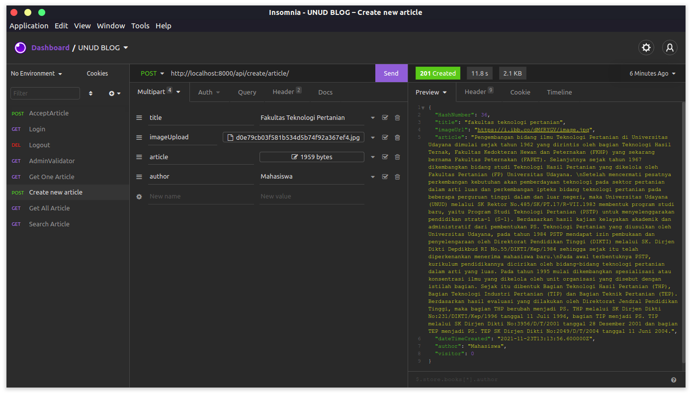
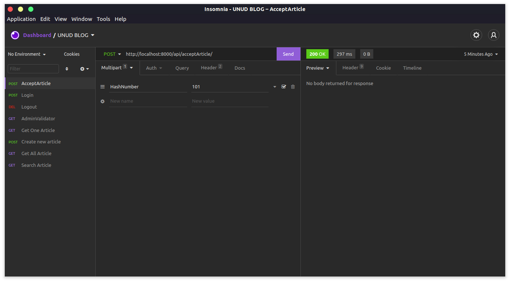
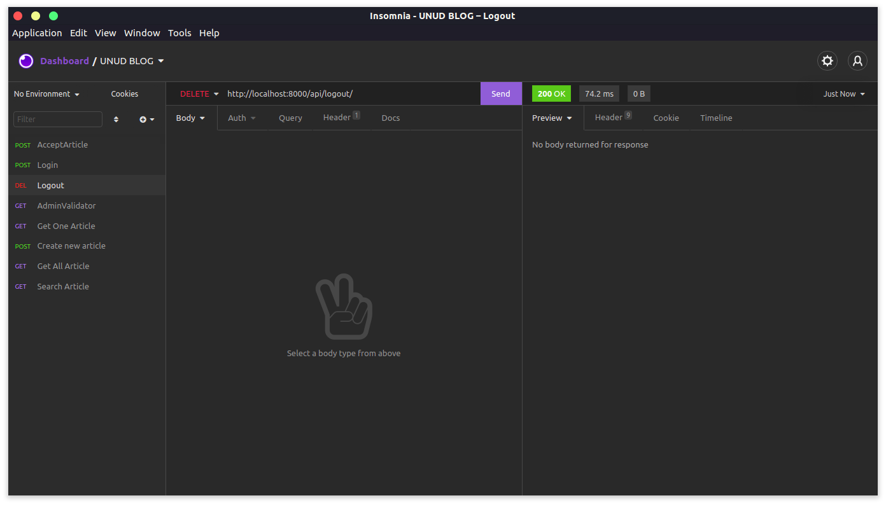

<h1 align="center">Stories Blog Udayana</h1>
<p align="center"></p>
Kumpulan artikel seputar Universitas Udayana.


## Installation

Use the package manager [pip](https://pip.pypa.io/en/stable/) to install all requirements.

```bash
pip install -r requirements.txt
```

## Start Server

```bash
python manage.py runserver
```

## API Reference
<h3 align="center">1. Get All Article [GUEST]</h3>
<h4 align="center">URL : https://unud-blog.herokuapp.com/api/blog-post/ </h4>
#### 

```http
   [GET] /api/blog-post/
```
#### Requirements
| Header | Type     | Description                       |
| :-------- | :------- | :-------------------------------- |
| `token`      | `string` | **Required** |

#### Response Example


#### 
<h3 align="center">2. Get One Article [GUEST]</h3>
<h4 align="center">URL : https://unud-blog.herokuapp.com/api/blog-post/one-item/ </h4>

```http
  [GET] /api/blog-post/one-item/
```
#### Requirements
| JSON Body | Type     | Description                       |
| :-------- | :------- | :-------------------------------- |
| `HashNumber`      | `string` | **Required** |

| Header | Type     | Description                       |
| :-------- | :------- | :-------------------------------- |
| `token`      | `string` | **Required** |

#### Response Example


#### 
<h3 align="center">3. Search Article [GUEST]</h3>
<h4 align="center">URL : https://unud-blog.herokuapp.com/api/search/ </h4>

```http
  [GET] /api/search/
```
#### Requirements
| JSON Body | Type     | Description                       |
| :-------- | :------- | :-------------------------------- |
| `keyword`      | `string` | **Required** |

| Header | Type     | Description                       |
| :-------- | :------- | :-------------------------------- |
| `token`      | `string` | **Required** |
#### Example Response


#### 
<h3 align="center">4. Create New Article [GUEST]</h3>
<h4 align="center">URL : https://unud-blog.herokuapp.com/api/create/article/ </h4>

```http
  [POST] /api/create/article/
```
#### Requirements
| Multipart | Type     | Description                       |
| :-------- | :------- | :-------------------------------- |
| `title`      | `string` | **Required** - Judul Artikel|
| `imageUpload`      | `image file` | **Required** - Gambar|
| `article`    | `string` | **Required** - Isi Artikel |
| `author`      | `string` | **Required** - Penulis Artikel|

| Header | Type     | Description                       |
| :-------- | :------- | :-------------------------------- |
| `token`      | `string` | **Required** |
#### Example Response


#### 
<h3 align="center">---------------------- Page Validator Article ------------------------</h3>
<h3 align="center">Get All Article [ADMIN]</h3>
<h4 align="center">URL : https://unud-blog.herokuapp.com/api/adminValidator/ </h4>

```http
  [GET] /api/adminValidator/
```
#### Requirements 
| Header | Type     | Description            | Catatan |
| :-------- | :------- | :------------------ | :---    |
| `sessionID`      | `string` | **Required** | `sessionID didapatkan dari login`  |

#### Response Example


<h3 align="center">Accept Article [ADMIN]</h3>
<h4 align="center">URL : https://unud-blog.herokuapp.com/api/acceptArticle/ </h4>

```http
  [POST] /api/acceptArticle/
```
#### Requirements 
| Multipart | Type     | Description                       |
| :-------- | :------- | :-------------------------------- |
| `HashNumber`      | `string` | **Required** |

| Header | Type     | Description            | Catatan |
| :-------- | :------- | :------------------ | :---    |
| `sessionID`      | `string` | **Required** | `sessionID didapatkan dari login`  |

#### Response Example


<h3 align="center">Login</h3>
<h4 align="center">URL : https://unud-blog.herokuapp.com/api/login/ </h4>

```http
  [GET] /api/login/
```
#### Requirements 
| JSON Body | Type     | Description            |
| :-------- | :------- | :------------------ |
| `usernameGET`      | `string` | **Required** |
| `passwordGET`      | `string` | **Required** |

#### Response Example


<h3 align="center">Logout</h3>
<h4 align="center">URL : https://unud-blog.herokuapp.com/api/logout/ </h4>

```http
  [DELETE] /api/logout/
```
#### Requirements 
| Header | Type     | Description            |
| :-------- | :------- | :------------------ |
| `sessionID`      | `string` | **Required** |

#### Response Example


  